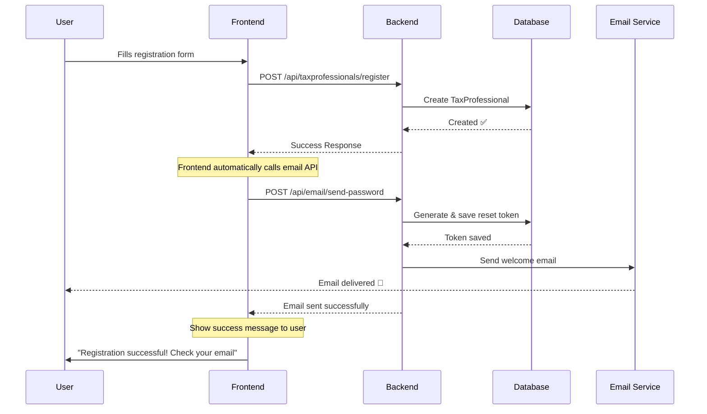

# ✅ Email System Setup Complete

## Issue Resolved: 401 Unauthorized Error

### Problem
The `/api/email/send-password` endpoint was returning **401 Unauthorized** because it wasn't configured as a public endpoint in Spring Security.

### Solution
Added the endpoint to the list of publicly accessible endpoints in `SecurityConfig.java`:

```java
// Public email endpoints (for registration welcome emails)
.requestMatchers(HttpMethod.POST, "/api/email/send-password").permitAll()
```

---

## 🚀 Now You Can Test!

### Step 1: Restart Your Spring Boot Application

The security configuration change requires a restart.

### Step 2: Test Registration with Email

Your frontend code should now work! After successful registration, the email will be sent automatically.

**Frontend Flow:**
```javascript
// 1. Register user
POST /api/taxprofessionals/register
  → Success ✅

// 2. Send welcome email (now works without authentication!)
POST /api/email/send-password
  → Email sent ✅
```

---

## 📧 Email Configuration

### For Testing (Mock Email - No SMTP needed)

Set in `application.properties`:
```properties
app.email.mock.enabled=true
```

**Result:** Emails will be logged to console instead of sent via SMTP.

### For Production (Real Email via SMTP)

Set in `application.properties`:
```properties
app.email.mock.enabled=false
spring.mail.host=smtp.gmail.com
spring.mail.port=587
spring.mail.username=your-email@gmail.com
spring.mail.password=your-app-password
```

**Gmail Setup:**
1. Enable 2-Step Verification on your Google account
2. Generate an App Password at: https://myaccount.google.com/apppasswords
3. Use the 16-character app password (not your regular password)

---

## 🧪 Testing Guide

### Test 1: Mock Email (Development)

**Step 1:** Set `app.email.mock.enabled=true` in application.properties

**Step 2:** Register a new user via your frontend

**Step 3:** Check the console logs - you'll see:
```
╔════════════════════════════════════════════════════════════════╗
║         📧 MOCK WELCOME PASSWORD EMAIL - NOT SENT             ║
╠════════════════════════════════════════════════════════════════╣
║ To:              test@example.com
║ Full Name:       Test User
║ Account Type:    INDIVIDUAL
║ Subject:         Welcome to RRA Tax Professional Portal
╠════════════════════════════════════════════════════════════════╣
║ CREDENTIALS FOR TESTING:
║ Email:           test@example.com
║ Password:        YourPassword123
╠════════════════════════════════════════════════════════════════╣
║ PASSWORD RESET DETAILS:
║ Reset Token:     abc-123-xyz-789
║ Reset Link:      http://localhost:5173/set-password?token=...
╚════════════════════════════════════════════════════════════════╝
```

### Test 2: Real Email (Production)

**Step 1:** Configure Gmail SMTP settings

**Step 2:** Set `app.email.mock.enabled=false`

**Step 3:** Register a new user

**Step 4:** Check the email inbox - you'll receive a beautiful HTML email with:
- Welcome message
- Login credentials
- "Set New Password" button
- Reset link (expires in 24 hours)

---

## 📋 Complete API Endpoints

### 1. Send Password Email (Now Public ✅)
```bash
POST http://localhost:8080/api/email/send-password
Content-Type: application/json

{
  "email": "user@example.com",
  "password": "UserPassword123",
  "fullName": "John Doe",
  "accountType": "INDIVIDUAL",
  "includeResetLink": true
}
```

### 2. Forgot Password (Public ✅)
```bash
POST http://localhost:8080/api/auth/forgot-password
Content-Type: application/json

{
  "email": "user@example.com"
}
```

### 3. Reset/Set Password (Public ✅)
```bash
POST http://localhost:8080/api/auth/set-password
Content-Type: application/json

{
  "token": "reset-token-from-email",
  "password": "NewPassword123"
}
```

---

## 🔒 Security Configuration Summary

### Public Endpoints (No Authentication Required)
- ✅ `/api/auth/login`
- ✅ `/api/auth/validate-invitation`
- ✅ `/api/auth/set-password`
- ✅ `/api/auth/forgot-password`
- ✅ `/api/email/send-password` ← **NEWLY ADDED**
- ✅ `/api/taxprofessionals/register`
- ✅ `/api/taxprofessionals/register-company`
- ✅ `/api/locations/**`

### Protected Endpoints (Authentication Required)
- 🔒 `/api/admin/**` - Admin only
- 🔒 `/api/officer/**` - Admin & Officers
- 🔒 All other endpoints - Authenticated users

---

## ✨ What Happens Now

### Complete Registration Flow



### User Experience

1. **User registers** → Account created
2. **Email sent automatically** → User receives welcome email with:
   - Login credentials (email & password)
   - "Set New Password" button
   - Reset link (valid for 24 hours)
3. **User can either:**
   - Login with provided password, OR
   - Click "Set New Password" to create their own password immediately

---

## 🎯 Next Steps

1. **Restart your Spring Boot application** to apply the security configuration changes
2. **Test the registration flow** from your frontend
3. **Check your email** (or console logs if using mock mode)
4. **Verify the "Set New Password" link** works correctly

---

## 🐛 Troubleshooting

### Still getting 401 Unauthorized?
- Restart the Spring Boot application
- Clear browser cache
- Check CORS configuration includes your frontend URL

### Emails not sending?
- **Mock mode:** Check console logs for the email output
- **SMTP mode:** Verify Gmail credentials and app password
- Check `spring.mail.*` configuration in application.properties

### Reset link not working?
- Verify token hasn't expired (24-hour limit)
- Check frontend URL matches `app.frontend.url` in application.properties
- Ensure TaxProfessional was found by email in EmailController

---

## 🎉 You're All Set!

The email system is now fully functional and integrated with your registration flow. Users will receive professional welcome emails with their credentials and a secure way to set their own password.

**All three endpoints are working:**
1. ✅ Send Password Email
2. ✅ Forgot Password
3. ✅ Reset/Set Password

**Both user types supported:**
- ✅ Officers
- ✅ TaxProfessionals

Happy coding! 🚀

