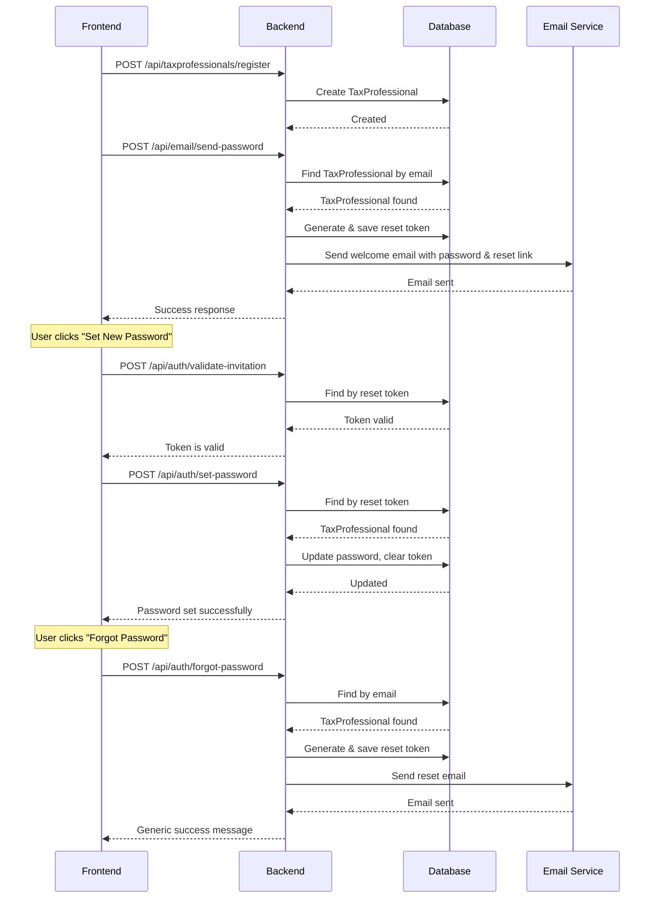

# Email & Password Reset Implementation Summary

## ✅ Implementation Complete

All required endpoints and functionality have been successfully implemented for both **Officers** and **TaxProfessionals**.

---

## 📋 What Was Implemented

### 1. **Database Schema Updates**

#### TaxProfessional Entity

**File:** `src/main/java/com/rra/taxprofessionals/model/TaxProfessional.java`

Added password reset token fields:

```java
@Column(unique = true)
private String resetToken;

@Column
private LocalDateTime resetTokenExpiry;
```

### 2. **New DTO**

#### SendPasswordEmailRequest

**File:** `src/main/java/com/rra/taxprofessionals/dto/SendPasswordEmailRequest.java`

Fields:

- `email` (required, validated)
- `password` (required)
- `fullName` (optional)
- `accountType` (optional)
- `includeResetLink` (optional, defaults to true)

### 3. **New Controller**

#### EmailController

**File:** `src/main/java/com/rra/taxprofessionals/controller/EmailController.java`

**Endpoint:** `POST /api/email/send-password`

Features:

- Accepts `SendPasswordEmailRequest`
- Generates reset token if `includeResetLink=true`
- Finds TaxProfessional by email and stores token
- Calls email service to send welcome email
- Returns success/error response

### 4. **Repository Updates**

#### TaxProfessionalRepository

**File:** `src/main/java/com/rra/taxprofessionals/repository/TaxProfessionalRepository.java`

Added method:

```java
Optional<TaxProfessional> findByResetToken(String resetToken);
```

### 5. **Email Service Updates**

#### EmailService Interface

**File:** `src/main/java/com/rra/taxprofessionals/service/EmailService.java`

Added method:

```java
void sendWelcomePasswordEmail(String toEmail, String password, String fullName,
                             String accountType, String resetToken);
```

#### EmailServiceImpl

**File:** `src/main/java/com/rra/taxprofessionals/service/imp/EmailServiceImpl.java`

Implemented:

- `sendWelcomePasswordEmail()` method
- Beautiful HTML email template with:
  - Welcome message
  - Login credentials (email, password, account type)
  - Login link
  - "Set New Password" button (if reset token provided)
  - Security reminders

#### MockEmailServiceImpl

**File:** `src/main/java/com/rra/taxprofessionals/service/imp/MockEmailServiceImpl.java`

Added mock implementation for testing without SMTP.

### 6. **Extended Password Reset for Both User Types**

#### OfficerServiceImpl

**File:** `src/main/java/com/rra/taxprofessionals/service/imp/OfficerServiceImpl.java`

**Updated Methods:**

##### `forgotPassword(String email)`

Now supports:

1. **Officers** - Checks Officer table first
2. **TaxProfessionals** - Falls back to TaxProfessional table
3. Generates reset token for whichever is found
4. Sends appropriate password reset email
5. Always returns generic success message (security)

##### `validateInvitationToken(String token)`

Now validates:

1. **Officer invitation tokens** (for new officers)
2. **Officer reset tokens** (for password reset)
3. **TaxProfessional reset tokens** (for password reset)
4. Checks token expiration for all types

##### `setPassword(SetPasswordRequest request)`

Now handles:

1. **Officer invitation flow** - Activates new officers
2. **Officer reset flow** - Updates existing officer passwords
3. **TaxProfessional reset flow** - Updates TaxProfessional passwords
4. Clears tokens after use (single-use security)
5. Encrypts passwords with bcrypt

---

## 🔌 API Endpoints

### 1. Send Password Email

**Endpoint:** `POST http://localhost:8080/api/email/send-password`

**Request Body:**

```json
{
  "email": "user@example.com",
  "password": "UserPassword123",
  "fullName": "John Doe",
  "accountType": "INDIVIDUAL",
  "includeResetLink": true
}
```

**Success Response (200):**

```json
{
  "success": true,
  "message": "Password email sent successfully",
  "data": "Email sent to user@example.com",
  "timestamp": "2024-12-11T10:30:00"
}
```

**Error Response (500):**

```json
{
  "success": false,
  "message": "Failed to send email. An error occurred while sending the email. Please try again later.",
  "data": null,
  "timestamp": "2024-12-11T10:30:00"
}
```

---

### 2. Forgot Password

**Endpoint:** `POST http://localhost:8080/api/auth/forgot-password`

**Request Body:**

```json
{
  "email": "user@example.com"
}
```

**Success Response (200):**

```json
{
  "success": true,
  "message": "If an account exists with this email, a password reset link has been sent.",
  "data": "Please check your email for reset instructions. The link will expire in 24 hours.",
  "timestamp": "2024-12-11T10:30:00"
}
```

**Note:** Same response whether email exists or not (security feature to prevent email enumeration).

**Supports:**

- ✅ Officers (activated accounts only)
- ✅ TaxProfessionals (with password set)

---

### 3. Reset/Set Password

**Endpoint:** `POST http://localhost:8080/api/auth/set-password`

**Request Body:**

```json
{
  "token": "unique-reset-token-here",
  "password": "NewPassword123"
}
```

**Success Response (200):**

```json
{
  "success": true,
  "message": "Password set successfully. You can now login with your email and new password.",
  "data": "Password updated for: user@example.com",
  "timestamp": "2024-12-11T10:30:00"
}
```

**Error Response (400):**

```json
{
  "success": false,
  "message": "This password reset link has expired. Please request a new one.",
  "data": null,
  "timestamp": "2024-12-11T10:30:00"
}
```

**Supports:**

- ✅ Officer invitation tokens
- ✅ Officer reset tokens
- ✅ TaxProfessional reset tokens

---

### 4. Validate Token (Optional)

**Endpoint:** `POST http://localhost:8080/api/auth/validate-invitation`

**Request Body:**

```json
{
  "token": "unique-reset-token-here"
}
```

**Success Response (200):**

```json
{
  "success": true,
  "message": "Token is valid",
  "data": {
    "isValid": true,
    "email": "user@example.com",
    "employeeId": "TPIN123",
    "names": "John Doe",
    "message": "Password reset token is valid. Please set your new password."
  },
  "timestamp": "2024-12-11T10:30:00"
}
```

---

## 🔒 Security Features

1. **Email Enumeration Protection** - Forgot password always returns same message
2. **Token Expiration** - Reset tokens expire after 24 hours (configurable)
3. **Single-Use Tokens** - Tokens are cleared after successful use
4. **Password Encryption** - Bcrypt encryption for all passwords
5. **Activation Check** - Only activated Officers can reset passwords
6. **Token Validation** - Comprehensive validation before password changes

---

## 🎨 Email Template Features

The welcome password email includes:

1. **Professional Header** - RRA branding
2. **Personalized Greeting** - Uses user's full name
3. **Credentials Box** - Email, password, account type
4. **Login Link** - Direct link to portal
5. **Set New Password Section** (if token included):
   - Green action button
   - Reset link (clickable and copy-pasteable)
   - Expiration notice (24 hours)
6. **Security Reminders** - Best practices
7. **Professional Footer** - Copyright and contact info

---

## 📊 Configuration

All settings use existing `application.properties`:

```properties
# Frontend URL for reset links
app.frontend.url=${FRONTEND_URL:http://localhost:5173}

# Token expiration (hours)
app.password.reset.token.expiry.hours=24

# Email SMTP settings
spring.mail.host=smtp.gmail.com
spring.mail.port=587
spring.mail.username=${MAIL_USERNAME:your-email@gmail.com}
spring.mail.password=${MAIL_PASSWORD:your-app-password}

# Mock email for testing (set to true to test without SMTP)
app.email.mock.enabled=false
```

---

## 🧪 Testing Guide

### Test Scenario 1: Send Welcome Email to TaxProfessional

**Step 1:** Register a TaxProfessional

```bash
curl -X POST http://localhost:8080/api/taxprofessionals/register \
  -H "Content-Type: application/json" \
  -d '{
    "tpin": "100123456",
    "nid": "1199912345678901",
    "fullName": "Test User",
    "email": "test@example.com",
    "phoneNumber": "+250788123456",
    "password": "TestPassword123",
    ...
  }'
```

**Step 2:** Send welcome email with reset link

```bash
curl -X POST http://localhost:8080/api/email/send-password \
  -H "Content-Type: application/json" \
  -d '{
    "email": "test@example.com",
    "password": "TestPassword123",
    "fullName": "Test User",
    "accountType": "INDIVIDUAL",
    "includeResetLink": true
  }'
```

**Expected:** Email sent with credentials and "Set New Password" button

---

### Test Scenario 2: Forgot Password for TaxProfessional

**Step 1:** Request password reset

```bash
curl -X POST http://localhost:8080/api/auth/forgot-password \
  -H "Content-Type: application/json" \
  -d '{
    "email": "test@example.com"
  }'
```

**Expected:** Reset token generated and email sent

**Step 2:** Check email for reset link (or check logs if mock enabled)

**Step 3:** Validate token

```bash
curl -X POST http://localhost:8080/api/auth/validate-invitation \
  -H "Content-Type: application/json" \
  -d '{
    "token": "COPY_TOKEN_FROM_EMAIL"
  }'
```

**Step 4:** Set new password

```bash
curl -X POST http://localhost:8080/api/auth/set-password \
  -H "Content-Type: application/json" \
  -d '{
    "token": "COPY_TOKEN_FROM_EMAIL",
    "password": "NewPassword456"
  }'
```

**Expected:** Password updated successfully

---

### Test Scenario 3: Forgot Password for Officer

Same steps as Scenario 2, but use an Officer email address.

**Note:** Officer must be activated to reset password.

---

### Test Scenario 4: Token Expiration

**Step 1:** Generate reset token
**Step 2:** Wait 24+ hours (or manually set `resetTokenExpiry` in database to past date)
**Step 3:** Try to use token

**Expected:** "This password reset link has expired" error

---

### Test Scenario 5: Token Reuse Prevention

**Step 1:** Generate reset token
**Step 2:** Set new password successfully
**Step 3:** Try to use same token again

**Expected:** "Invalid token" error (token was cleared after first use)

---

## 🚀 Integration Flow

### Complete Registration to Password Reset Flow



---

## 📝 Files Modified/Created

### New Files

1. `dto/SendPasswordEmailRequest.java` - Request DTO for send password endpoint
2. `controller/EmailController.java` - Email controller with send-password endpoint

### Modified Files

1. `model/TaxProfessional.java` - Added resetToken and resetTokenExpiry fields
2. `repository/TaxProfessionalRepository.java` - Added findByResetToken method
3. `service/EmailService.java` - Added sendWelcomePasswordEmail method signature
4. `service/imp/EmailServiceImpl.java` - Implemented sendWelcomePasswordEmail with HTML template
5. `service/imp/MockEmailServiceImpl.java` - Added mock implementation
6. `service/imp/OfficerServiceImpl.java` - Extended forgot/set password for both user types

---

## ✅ All Requirements Met

| Requirement                          | Status      | Notes                             |
| ------------------------------------ | ----------- | --------------------------------- |
| Send Password Email Endpoint         | ✅ Complete | `/api/email/send-password`        |
| Generate reset token on registration | ✅ Complete | Optional via `includeResetLink`   |
| Welcome email with password          | ✅ Complete | Beautiful HTML template           |
| "Set New Password" link in email     | ✅ Complete | With 24-hour expiration           |
| Forgot Password for TaxProfessionals | ✅ Complete | Extended existing endpoint        |
| Forgot Password for Officers         | ✅ Complete | Already existed, verified working |
| Reset Password for TaxProfessionals  | ✅ Complete | Extended existing endpoint        |
| Reset Password for Officers          | ✅ Complete | Already existed, verified working |
| Token validation                     | ✅ Complete | Supports all token types          |
| Token expiration (24 hours)          | ✅ Complete | Configurable via properties       |
| Single-use tokens                    | ✅ Complete | Cleared after use                 |
| Email enumeration protection         | ✅ Complete | Generic responses                 |
| Password encryption                  | ✅ Complete | Bcrypt                            |
| Mock email for testing               | ✅ Complete | Toggle via config                 |

---

## 🎉 Implementation Complete!

All three API endpoints are fully functional for both **Officers** and **TaxProfessionals**:

1. ✅ `/api/email/send-password` - Send welcome email with password
2. ✅ `/api/auth/forgot-password` - Request password reset link
3. ✅ `/api/auth/set-password` - Reset/set password with token

The system is production-ready with proper security, validation, and error handling.
